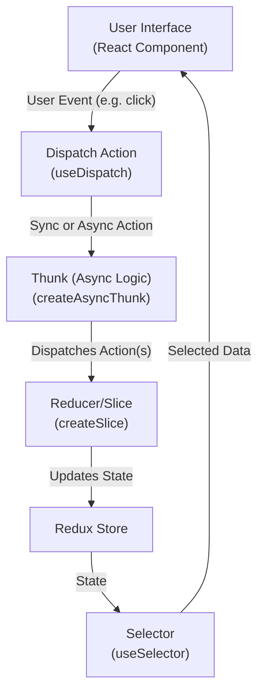

# Redux Toolkit Guide

## Introduction to Redux Toolkit

Redux Toolkit is the official, recommended way to write Redux logic in modern React applications. It provides a set of tools and best practices that make it easier and faster to manage your app’s state, reducing boilerplate and helping you write more maintainable code.

## Why Use Redux Toolkit?

Managing state in large applications can get complicated. Redux Toolkit simplifies this by:
- Reducing repetitive code
- Encouraging best practices
- Making it easier to write scalable and testable state logic

## Understanding State Management (with Analogies)

Imagine your application is like a restaurant:

- **State** is like the restaurant’s order board. It keeps track of all the current orders (data) so everyone knows what’s happening.
- **Actions** are like order slips that waiters bring to the kitchen. They describe what needs to happen (e.g., “Make a pizza”).
- **Reducers** are like the chefs who read the order slips and update the order board accordingly (“Pizza is being made!”).
- **Dispatch** is the act of handing the order slip to the kitchen.
- **Store** is the kitchen itself, where all the orders (state) are managed and updated.

## Key Vocabulary and Definitions

- **State**: The current data or situation of your app. Think of it as the “single source of truth” for your application’s data.
- **Action**: An object that describes something that happened in the app. It usually has a type (what happened) and sometimes a payload (extra data).
- **Payload**: The additional information sent with an action. For example, if you want to add a new item, the payload would be the item’s details.
- **Dispatch**: The process of sending an action to the store so it can update the state.
- **Reducer**: A function that takes the current state and an action, and returns a new state based on what happened.
- **Store**: The centralized place where your app’s state lives.
- **Selector**: A function that extracts specific data from the state for use in your components.
- **Slice**: A section of the Redux state and the logic (reducers, actions) that manages it. Redux Toolkit helps you create slices easily.
- **Thunk**: A special kind of function that lets you write async logic (like fetching data from an API) that interacts with the Redux store. Thunks are used to handle side effects in Redux, such as making HTTP requests or performing async operations before dispatching actions to update the state.

---

## Visualizing Redux Toolkit State Management Flow

Below is a diagram that shows how data flows through Redux Toolkit when you interact with your application:



**Explanation:**
- The user interacts with the UI (e.g., clicks a button).
- The UI dispatches an action (possibly using a thunk for async logic).
- The thunk may perform async work (like fetching data) and then dispatches more actions.
- The reducer (in a slice) updates the state in the Redux store based on the action.
- The UI uses selectors to read the updated state from the store and re-renders as needed.

---

## Advanced Redux Toolkit Project Structure

For scalable, maintainable applications, it’s best to separate concerns into different files and folders. Here’s a recommended structure for a feature-rich, industry-level Redux Toolkit setup:

```
src/
  features/
    products/
      productTypes.ts
      productSlice.ts
      productThunks.ts
      productSelectors.ts
  hooks/
    redux.ts
  services/
    api.ts
  store/
    rootReducers.ts
    middleware.ts
    index.ts
```

Each file and folder has a specific responsibility, making your codebase easier to understand and maintain.

---

### 1. Product Types (`src/features/products/productTypes.ts`)

This file contains all the TypeScript types related to products. Types help catch errors early and make your code more readable and maintainable.

```ts
// src/features/products/productTypes.ts

/**
 * Product entity type
 * Represents a single product in our application.
 */
export interface Product {
  id: number;           // Unique identifier for the product
  name: string;         // Name of the product
  description: string;  // Description of the product
  price: number;        // Price of the product
  category: string;     // Category the product belongs to
}

/**
 * API response for fetching products
 * Used to type the response from the backend when fetching products.
 */
export interface ProductResponse {
  products: Product[];  // Array of products
  total: number;        // Total number of products (for pagination, etc.)
}

/**
 * API request for creating/updating a product
 * Used to type the data sent to the backend when creating or updating a product.
 */
export interface ProductRequest {
  name: string;
  description: string;
  price: number;
  category: string;
}
```

---

### 2. Product Slice (`src/features/products/productSlice.ts`)

This file contains the Redux slice for products. A slice holds the state and reducers for a specific feature. It also connects to async thunks for handling side effects like API calls.

```ts
// src/features/products/productSlice.ts
import { createSlice, PayloadAction } from '@reduxjs/toolkit';
import { Product } from './productTypes';
import { fetchProducts } from './productThunks';

// Define the shape of the product state
interface ProductState {
  products: Product[];      // List of products
  loading: boolean;         // Loading state for async actions
  error: string | null;     // Error message, if any
}

// Initial state for the product slice
const initialState: ProductState = {
  products: [],
  loading: false,
  error: null,
};

// Create the product slice
const productSlice = createSlice({
  name: 'products',
  initialState,
  reducers: {
    // Add synchronous reducers here if needed (e.g., for local state changes)
  },
  extraReducers: (builder) => {
    // Handle async thunk actions
    builder
      .addCase(fetchProducts.pending, (state) => {
        state.loading = true;
        state.error = null;
      })
      .addCase(fetchProducts.fulfilled, (state, action: PayloadAction<Product[]>) => {
        state.loading = false;
        state.products = action.payload;
      })
      .addCase(fetchProducts.rejected, (state, action) => {
        state.loading = false;
        state.error = action.payload || 'Unknown error';
      });
  },
});

// Export the reducer to be used in the store
export default productSlice.reducer;
```

**Explanation:**
- The slice manages the product state, including loading and error states.
- It listens for actions from the async thunk (fetchProducts) and updates the state accordingly.

---

### 3. Product Thunks (`src/features/products/productThunks.ts`)

This file contains all the async logic (thunks) for products. Thunks are used for side effects like fetching data from an API.

```ts
// src/features/products/productThunks.ts
import { createAsyncThunk } from '@reduxjs/toolkit';
import { Product } from './productTypes';
import api from '../../services/api';

/**
 * Async thunk to fetch products from the API
 * Dispatches pending, fulfilled, and rejected actions automatically
 */
export const fetchProducts = createAsyncThunk<Product[], void, { rejectValue: string }>(
  'products/fetchProducts',
  async (_, { rejectWithValue }) => {
    try {
      // Make a GET request to the /products endpoint
      const response = await api.get('/products');
      // Return the array of products from the response
      return response.data.products;
    } catch (error: any) {
      // If there's an error, return a rejected value
      return rejectWithValue(error.message || 'Failed to fetch products');
    }
  }
);
```

**Explanation:**
- `createAsyncThunk` simplifies writing async logic and automatically generates actions for pending, fulfilled, and rejected states.
- The thunk uses the shared Axios instance to make API calls.

---

### 4. Product Selectors (`src/features/products/productSelectors.ts`)

Selectors are functions that extract and return specific pieces of data from the Redux state. They help keep your components clean and make it easy to reuse logic for accessing state.

```ts
// src/features/products/productSelectors.ts
import { RootState } from '../../store';
import { Product } from './productTypes';

/**
 * Select all products from the state
 */
export const selectAllProducts = (state: RootState): Product[] => state.products.products;

/**
 * Select products by category
 */
export const selectProductsByCategory = (category: string) => (state: RootState): Product[] =>
  state.products.products.filter((product) => product.category === category);

/**
 * Select loading state
 */
export const selectProductsLoading = (state: RootState): boolean => state.products.loading;

/**
 * Select error state
 */
export const selectProductsError = (state: RootState): string | null => state.products.error;
```

**Explanation:**
- Selectors make it easy to get exactly the data you need from the Redux state.
- You can create simple selectors (like all products) or parameterized selectors (like products by category).

---

### 5. API Service (`src/services/api.ts`)

This file creates a centralized Axios instance for making HTTP requests. Using a shared instance makes it easy to set base URLs, headers, and interceptors for all API calls in your app.

```ts
// src/services/api.ts
import axios from 'axios';

// Create an Axios instance with default settings
const api = axios.create({
  baseURL: 'https://fakestoreapi.com', // Base URL for all API requests
  timeout: 10000,                      // Request timeout (ms)
  headers: {
    'Content-Type': 'application/json',
  },
});

export default api;
```

**Explanation:**
- All API calls in your app should use this `api` instance for consistency and maintainability.

---

### 6. Typed Redux Hooks (`src/hooks/redux.ts`)

This file provides custom hooks for using Redux in your components, with full TypeScript support. This ensures you get type safety and autocompletion everywhere you use Redux.

```ts
// src/hooks/redux.ts
import { TypedUseSelectorHook, useDispatch, useSelector } from 'react-redux';
import type { RootState, AppDispatch } from '../store';

// Use throughout your app instead of plain `useDispatch` and `useSelector`
export const useAppDispatch = () => useDispatch<AppDispatch>();
export const useAppSelector: TypedUseSelectorHook<RootState> = useSelector;
```

**Explanation:**
- `useAppDispatch` and `useAppSelector` are typed versions of the standard Redux hooks, making your code safer and easier to work with.

---

### 7. Store Setup

#### Root Reducers (`src/store/rootReducers.ts`)

This file combines all your feature reducers into a single root reducer. This makes it easy to add more features in the future.

```ts
// src/store/rootReducers.ts
import { combineReducers } from '@reduxjs/toolkit';
import productReducer from '../features/products/productSlice';

// Combine all feature reducers here
const rootReducer = combineReducers({
  products: productReducer,
  // add other reducers here as your app grows
});

export default rootReducer;
```

#### Middleware (`src/store/middleware.ts`)

This file is where you add custom or third-party middleware. Middleware can be used for logging, analytics, or handling side effects.

```ts
// src/store/middleware.ts
import { Middleware } from '@reduxjs/toolkit';

// Example: simple logger middleware that logs every action
export const loggerMiddleware: Middleware = (store) => (next) => (action) => {
  console.log('Dispatching:', action);
  return next(action);
};

// Export as an array so you can add more middleware easily
export default [loggerMiddleware];
```

#### Store Index (`src/store/index.ts`)

This file configures the Redux store, combining reducers and middleware. It also exports types for use throughout your app.

```ts
// src/store/index.ts
import { configureStore } from '@reduxjs/toolkit';
import rootReducer from './rootReducers';
import middleware from './middleware';
import { productApi } from '../features/products/productApi';

export const store = configureStore({
  reducer: {
    ...rootReducer,
    [productApi.reducerPath]: productApi.reducer,
  },
  middleware: (getDefaultMiddleware) =>
    getDefaultMiddleware().concat(middleware).concat(productApi.middleware),
});

export type RootState = ReturnType<typeof store.getState>;
export type AppDispatch = typeof store.dispatch;
```

**Explanation:**
- The store brings together all reducers and middleware, making your app’s state management centralized and predictable.

---

### 8. Provide the Store to React

This step makes the Redux store available to your entire React app. You only need to do this once, at the root of your app.

```tsx
// src/main.tsx
import React from 'react';
import ReactDOM from 'react-dom/client';
import { Provider } from 'react-redux';
import { store } from './store';
import App from './App';

// Wrap your app with the Redux Provider
ReactDOM.createRoot(document.getElementById('root')!).render(
  <React.StrictMode>
    <Provider store={store}>
      <App />
    </Provider>
  </React.StrictMode>
);
```

**Explanation:**
- The `<Provider>` component makes the Redux store available to all components in your app.

---

### 9. Using Selectors in a Component

Here’s how you can use selectors in your components to access and display filtered data from the Redux store.

```tsx
// src/components/ProductList.tsx
import React, { useEffect } from 'react';
import { useAppDispatch, useAppSelector } from '../hooks/redux';
import { fetchProducts } from '../features/products/productThunks';
import { selectAllProducts, selectProductsByCategory, selectProductsLoading, selectProductsError } from '../features/products/productSelectors';

const ProductList: React.FC<{ category?: string }> = ({ category }) => {
  const dispatch = useAppDispatch();
  // Use selectors to get data from the store
  const products = useAppSelector(category ? selectProductsByCategory(category) : selectAllProducts);
  const loading = useAppSelector(selectProductsLoading);
  const error = useAppSelector(selectProductsError);

  useEffect(() => {
    dispatch(fetchProducts());
  }, [dispatch]);

  if (loading) return <div>Loading...</div>;
  if (error) return <div>Error: {error}</div>;

  return (
    <ul>
      {products.map((product) => (
        <li key={product.id}>
          <h3>{product.name}</h3>
          <p>{product.description}</p>
          <strong>${product.price}</strong>
          <em>{product.category}</em>
        </li>
      ))}
    </ul>
  );
};

export default ProductList;
```

**Explanation:**
- The component uses selectors to access the Redux state, making the code cleaner and more maintainable.
- You can easily filter products by category or get all products, and handle loading and error states with dedicated selectors.

### 10. Extra

You can always include additional, more advanced patterns such as using [Reselect](https://github.com/reduxjs/reselect) for memoized selectors or other memoization techniques to optimize performance, especially when working with derived or computed data from your Redux state.

## Working with RTK Query

RTK Query is a powerful data fetching and caching tool that comes built-in with Redux Toolkit. It helps you manage server-side data in your application with minimal boilerplate, handling fetching, caching, updating, and even background refetching out of the box.

### What is RTK Query?

RTK Query is a data fetching and caching solution for Redux applications. It is designed to simplify data fetching logic, reduce the need for manual thunks and reducers, and provide automatic caching, invalidation, and refetching of data.

**Key Benefits:**
- Eliminates the need to write thunks, reducers, and actions for most server interactions
- Handles caching, background updates, and cache invalidation automatically
- Integrates seamlessly with Redux Toolkit and TypeScript
- Reduces boilerplate and improves maintainability

---

### RTK Query Concepts

- **API Slice:** Central place to define endpoints (queries and mutations) for your backend.
- **Query:** Used to fetch data (GET requests). RTK Query generates hooks for you to use in components.
- **Mutation:** Used to create, update, or delete data (POST, PUT, DELETE requests). Also generates hooks.
- **Caching:** RTK Query automatically caches fetched data and shares it across components.
- **Invalidation:** You can mark data as "stale" after a mutation, so queries refetch fresh data.
- **Auto-Refetching:** RTK Query can refetch data in the background when you re-focus a window or reconnect to the internet.
- **Loading/Error/Success States:** Hooks provide easy access to loading, error, and success states for UI feedback.

---

### 1. Install RTK Query

RTK Query is included with Redux Toolkit (v1.6+), but you also need to install `react-redux` if you haven't already:

```bash
npm install @reduxjs/toolkit react-redux
```

---

### 2. Create an API Slice (`src/features/products/productApi.ts`)

An API slice defines endpoints and how to fetch or mutate data from your backend. RTK Query generates hooks for you to use in your components.

```ts
// src/features/products/productApi.ts
import { createApi, fetchBaseQuery } from '@reduxjs/toolkit/query/react';
import { Product, ProductRequest } from './productTypes';

export const productApi = createApi({
  reducerPath: 'productApi',
  baseQuery: fetchBaseQuery({ baseUrl: 'https://fakestoreapi.com' }),
  tagTypes: ['Product'], // Used for cache invalidation
  endpoints: (builder) => ({
    // Query: Fetch all products
    getProducts: builder.query<Product[], void>({
      query: () => '/products',
      providesTags: (result) =>
        result
          ? [
              ...result.map(({ id }) => ({ type: 'Product' as const, id })),
              { type: 'Product', id: 'LIST' },
            ]
          : [{ type: 'Product', id: 'LIST' }],
    }),
    // Query: Fetch a single product by ID
    getProductById: builder.query<Product, number>({
      query: (id) => `/products/${id}`,
      providesTags: (result, error, id) => [{ type: 'Product', id }],
    }),
    // Mutation: Add a new product
    addProduct: builder.mutation<Product, ProductRequest>({
      query: (newProduct) => ({
        url: '/products',
        method: 'POST',
        body: newProduct,
      }),
      invalidatesTags: [{ type: 'Product', id: 'LIST' }], // Invalidate product list cache
    }),
    // Mutation: Delete a product
    deleteProduct: builder.mutation<{ success: boolean; id: number }, number>({
      query: (id) => ({
        url: `/products/${id}`,
        method: 'DELETE',
      }),
      invalidatesTags: (result, error, id) => [
        { type: 'Product', id },
        { type: 'Product', id: 'LIST' },
      ],
    }),
    // You can add more mutations (update, etc.) as needed
  }),
});

// Export hooks for usage in functional components
export const {
  useGetProductsQuery,
  useGetProductByIdQuery,
  useAddProductMutation,
  useDeleteProductMutation,
} = productApi;
```

**Explanation:**
- `createApi` sets up endpoints and generates hooks for data fetching and mutations.
- `tagTypes` and `providesTags`/`invalidatesTags` are used for cache invalidation.
- Each endpoint describes how to fetch or mutate data.
- RTK Query automatically generates React hooks (e.g., `useGetProductsQuery`, `useAddProductMutation`).

---

### 3. Add the API Slice to the Store

You need to add the API slice’s reducer and middleware to your Redux store configuration.

```ts
// src/store/index.ts
import { configureStore } from '@reduxjs/toolkit';
import rootReducer from './rootReducers';
import middleware from './middleware';
import { productApi } from '../features/products/productApi';

export const store = configureStore({
  reducer: {
    ...rootReducer,
    [productApi.reducerPath]: productApi.reducer,
  },
  middleware: (getDefaultMiddleware) =>
    getDefaultMiddleware().concat(middleware).concat(productApi.middleware),
});

export type RootState = ReturnType<typeof store.getState>;
export type AppDispatch = typeof store.dispatch;
```

**Explanation:**
- Add the API slice’s reducer under a unique key (`productApi.reducerPath`).
- Add the API middleware to enable caching, invalidation, and other RTK Query features.

---

### 4. Using RTK Query Hooks in a Component

You can now use the auto-generated hooks in your components to fetch, add, or delete products. RTK Query handles loading, error, and success states for you.

#### Fetching Products

```tsx
// src/components/ProductListRTKQ.tsx
import React from 'react';
import { useGetProductsQuery, useDeleteProductMutation } from '../features/products/productApi';

const ProductListRTKQ: React.FC = () => {
  const { data: products, error, isLoading, refetch } = useGetProductsQuery();
  const [deleteProduct, { isLoading: isDeleting }] = useDeleteProductMutation();

  if (isLoading) return <div>Loading...</div>;
  if (error) return <div>Error: {error instanceof Error ? error.message : 'Unknown error'}</div>;

  return (
    <div>
      <button onClick={() => refetch()}>Refetch Products</button>
      <ul>
        {products?.map((product) => (
          <li key={product.id}>
            <h3>{product.name}</h3>
            <p>{product.description}</p>
            <strong>${product.price}</strong>
            <em>{product.category}</em>
            <button
              onClick={() => deleteProduct(product.id)}
              disabled={isDeleting}
            >
              Delete
            </button>
          </li>
        ))}
      </ul>
    </div>
  );
};

export default ProductListRTKQ;
```

#### Adding a Product

```tsx
// src/components/AddProductForm.tsx
import React, { useState } from 'react';
import { useAddProductMutation } from '../features/products/productApi';

const AddProductForm: React.FC = () => {
  const [addProduct, { isLoading, isSuccess, error }] = useAddProductMutation();
  const [form, setForm] = useState({ name: '', description: '', price: '', category: '' });

  const handleChange = (e: React.ChangeEvent<HTMLInputElement>) => {
    setForm({ ...form, [e.target.name]: e.target.value });
  };

  const handleSubmit = async (e: React.FormEvent) => {
    e.preventDefault();
    await addProduct({
      name: form.name,
      description: form.description,
      price: parseFloat(form.price),
      category: form.category,
    });
  };

  return (
    <form onSubmit={handleSubmit}>
      <input name="name" value={form.name} onChange={handleChange} placeholder="Name" required />
      <input name="description" value={form.description} onChange={handleChange} placeholder="Description" required />
      <input name="price" value={form.price} onChange={handleChange} placeholder="Price" required type="number" />
      <input name="category" value={form.category} onChange={handleChange} placeholder="Category" required />
      <button type="submit" disabled={isLoading}>Add Product</button>
      {isSuccess && <span>Product added!</span>}
      {error && <span>Error: {error instanceof Error ? error.message : 'Unknown error'}</span>}
    </form>
  );
};

export default AddProductForm;
```

**Explanation:**
- The hooks provide `isLoading`, `isSuccess`, `error`, and other states for easy UI feedback.
- Mutations (like `addProduct`) can be called as functions and return promises.
- You can refetch queries or invalidate cache after mutations for up-to-date data.

---

### 5. Cache Invalidation and Refetching

RTK Query automatically caches data and can invalidate or refetch it when needed:
- Use `invalidatesTags` in mutations to mark data as stale (e.g., after adding or deleting a product).
- Use the `refetch` function from query hooks to manually refetch data.
- RTK Query can also refetch data automatically when the window regains focus or reconnects to the internet.

---

### 6. Best Practices and Tips

- Use `tagTypes`, `providesTags`, and `invalidatesTags` for fine-grained cache control.
- Use the auto-generated hooks for all data fetching and mutations in your components.
- Handle loading, error, and success states in your UI for a great user experience.
- Use the `refetch` method or cache invalidation to keep your data fresh after mutations.
- RTK Query works great with TypeScript for type-safe data fetching.

---

RTK Query is a modern, efficient way to handle server data in Redux applications. It reduces boilerplate, improves performance, and keeps your codebase clean and maintainable. For more advanced usage, see the [official RTK Query documentation](https://redux-toolkit.js.org/rtk-query/overview).
